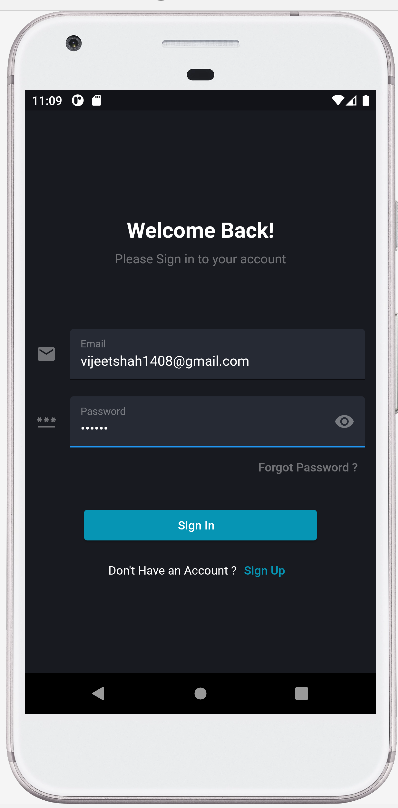
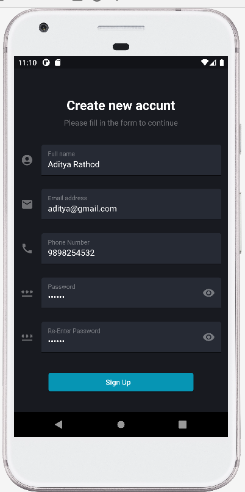

# online_ordering_system

<h1 align="center">Cybershop- Flutter Online Ordering System App

</h1>

  <a href="#bulb-aboutapp">About App</a> &#xa0; | &#xa0; 
  <a href="#dart-features">Features</a> &#xa0; | &#xa0;
  <a href="#rocket-resources">Resources</a> &#xa0; | &#xa0;

## :bulb: AboutApp:
Cybershop is a clean, minimal design and very detailed E-commerce App. It comes with modern app design and keep the thoughts of user experience in mind. Cybershop– Flutter online ordering system App  is exclusively made for eCommerce industries.You can easily customize the screens, allowing for great flexibility and ease of use when it comes to putting the finishing touch on your project.

## :dart: Features:

• 15+ High Quality iOS & Android Screens

• Clean, unique and modern style

• Layered & Well Organized

• User-friendly product searching and sorting

• Easy to customize

🎯 The App will contain a few components: Splash Screens,Sign In Screen, SignUp Screen,Forgot Password Screen, Home Screen, List of Categories, Category Product Screens, Product Details Screen with Rating and Reviews, Ordering Process, User Profile with Notifications and Favorites.

## 📲Splash Screen:
Onboarding Screen gives a short overview of an app. This Screen consists of three layouts which slide as we swipe left.

|             Splash Screen 1                            
| :--------------------------------:       
|             

## 🔐Sign In/Sign Up Screen:

Sign Up will be done using email, name and password. Google and Facebook login included as well as forgot your password screen.

|               Sign In                    |                 Sign Up                   |              
| :--------------------------------:       | :---------------------------------------: | 
|             |            | 

|          With Credentials                |              With Credentials             |              
| :--------------------------------:       | :---------------------------------------: |
|             |            | 

## 🔑Forgot Password Screen:

On the Login page, we will use Forgot Password bottom to reset the password. On tapping it will navigate us to forget password screen, it will have one reset password button. This button will trigger the verify method that will send an OTP to the given mail.

|          Forgot Password Screen          |            
| :--------------------------------:       | 
|    | 

## 🔎Home Screen:
This screen shows all the products with their name, image, and price. Here you can search for the products or toggle between the girdview and listview. On tapping the item, it opens the product details page.

|             Home Screen              |                
| :--------------------------------:   | 
|     | 

## 📇Product details screen:
Provides information on a specific product. This information includes size, color, price, product information, reviews, and other relevant information customers want to know before purchasing. Here,customers can change the attributes of an item, move an item to a wish list, or remove an item from the shopping cart.

|             Product 1                         |                Product 2                  
| :-------------------------------------------: | :---------------------------------------:
|                  |        

## Wishlist screen:
Provides information on a Favorite product. This information includes price, product information, image and you can add product to cart from here also but can't increase pr descrease quantiy .

|             Wishlist                          |                Empty wishlist
| :-------------------------------------------: | :---------------------------------------:
|                |     

## 🛒Cart page:

The Shopping Cart page lists all of the items that a customer added to their shopping cart. Customers begin the checkout process from the Current Order page. Customers can also apply promotional codes and coupons, or select promotional gifts.

|             Items in Cart                |                  Empty Cart
| :--------------------------------:       |  : ------------------------------------
|               |         

## Order History:
This screen shows all the ordered products with their name, image, quantity and price. 

|             Order History             |                
| :--------------------------------:   | 
|     | 

## 👤 Profile page:
A profile page represents information regarding an user's identity. It may contain personal data, a profile photo and more.

|             MyAccount Drawer             |             Change Password          
| :--------------------------------:       | :------------------------------------------:
|            |     

## :rocket: Resources:
- [Flutter Official Docs](https://flutter.dev/docs)
- [Flutter Community Medium](https://medium.com/flutter-community)
- [UI Inspiration](https://github.com/abuanwar072/E-commerce-Complete-Flutter-UI)
- [Icons/Emojis](https://emojipedia.org/)
- [Stack Overflow: Flutter](https://stackoverflow.com/questions/tagged/flutter)